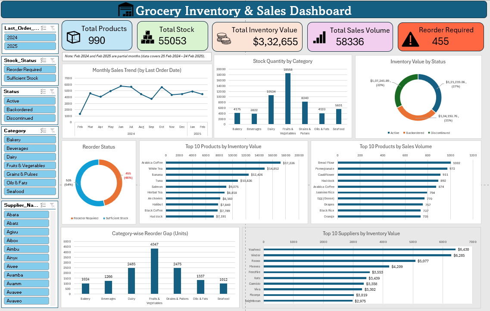

# 🛒 Grocery Inventory & Sales Dashboard (Excel)

An interactive Excel dashboard that analyses grocery inventory and sales data: stock levels, inventory value, reorder needs, top products and suppliers, and monthly sales trends.

> **Note:** This is a practice project built on a sample dataset. Insights are for learning purposes and not based on a real business.

---

## 📸 Dashboard Preview



---

## 🎯 Objective

To turn raw inventory data into a clear, interactive dashboard that helps answer:

- How much stock do we have, and what is it worth?
- Which products and categories need reordering?
- Which products and suppliers contribute the most value?
- How do sales change over time?
- How much money is tied up in discontinued or backordered items?

---

## 📂 Dataset

| Detail | Value |
|---|---|
| Records | 990 products |
| Categories | 7 (Bakery, Beverages, Dairy, Fruits & Vegetables, Grains & Pulses, Oils & Fats, Seafood) |
| Period | 25 Feb 2024 – 24 Feb 2025 |
| Source | Sample / practice dataset |

**Key columns:** Product_ID, Product_Name, Category, Supplier_Name, Stock_Quantity, Reorder_Level, Reorder_Quantity, Unit_Price, Date_Received, Last_Order_Date, Expiration_Date, Sales_Volume, Inventory_Turnover_Rate, Status

**Calculated columns added:**

| Column | Formula idea |
|---|---|
| `Inventory_Value` | Stock_Quantity × Unit_Price |
| `Reorder_Gap` | MAX(0, Reorder_Level − Stock_Quantity) |
| `Stock_Status` | "Reorder Required" if Stock_Quantity < Reorder_Level, else "Sufficient Stock" |
| `Date_Check` | Flags rows where dates look inconsistent (e.g., expiry before received) |

---

## 📊 Dashboard Components

### KPI Cards
- Total Products
- Total Stock
- Total Inventory Value
- Total Sales Volume
- Reorder Required

### Charts
| Chart | Purpose |
|---|---|
| Monthly Sales Trend | Sales over time (based on Last Order Date) |
| Stock Quantity by Category | Stock distribution across categories |
| Inventory Value by Status | Value split across Active / Backordered / Discontinued |
| Reorder Status | Share of products needing reorder |
| Top 10 Products by Inventory Value | Where the most money is tied up |
| Top 10 Products by Sales Volume | Best-selling products |
| Category-wise Reorder Gap (Units) | Categories with the biggest stock shortage |
| Top 10 Suppliers by Inventory Value | Suppliers with the highest stock value |

### Slicers (filter the whole dashboard)
`Stock_Status` · `Status` · `Category` · `Supplier_Name` · `Last_Order_Date (Year)`

---

## 🔍 Key Insights

- **455 of 990 products (46%)** are below their reorder level.
- **Fruits & Vegetables** has the highest stock (18,558 units) and the largest reorder gap (4,347 units). It also has the most products (332), so volumes are naturally higher.
- **Discontinued items** hold about **$107K (32%)** of total inventory value, so there may be capital stuck in stock that won't sell.
- Inventory value is split fairly evenly across statuses: Active $121K (37%), Discontinued $107K (32%), Backordered $104K (31%).
- Sales **peaked in June and October** and **dipped in September**.
- **Arabica Coffee** has the highest inventory value ($17,236) and also ranks in the top 5 by sales volume.
- **Bread Flour** is the top product by sales volume (1,002 units).
- Top supplier by inventory value: **Youfeed** ($6,430).

> Feb 2024 and Feb 2025 are **partial months** (data starts 25 Feb 2024 and ends 24 Feb 2025), so their sales totals look lower.

---

## 🛠️ Tools & Skills Used

- Microsoft Excel
- Excel Tables
- Pivot Tables & PivotCharts
- Slicers (connected across all pivots)
- Calculated columns using formulas (`IF`, `MAX`)
- Dashboard layout and visual design

---

## 📁 Repository Structure

```
├── README.md
├── data/
│   └── data.xlsx            # Raw dataset
├── dashboard/
│   └── Grocery_Inventory_Dashboard.xlsx
└── images/
    └── dashboard.png        # Dashboard screenshot
```

---

## ▶️ How to Use

1. Download the Excel file from the `dashboard/` folder.
2. Open it in Microsoft Excel (2016 or later recommended).
3. Use the slicers on the left to filter by stock status, category, supplier, status, or year.
4. If values don't refresh, go to **Data → Refresh All**.

---

## 💡 Possible Improvements

- Add a "% of items needing reorder by category" chart for a fairer comparison
- Add an expiry-risk view for products close to expiration
- Build the same dashboard in Power BI or Tableau
- Clean and flag rows flagged by `Date_Check` before analysis

---

## 🤝 Feedback

Suggestions and feedback are welcome! Feel free to open an issue or connect with me on LinkedIn.

**Author:** 
[Mohd Zaid] 
LinkedIn (https://www.linkedin.com/in/mohd-zaid-718724373) 
Portfolio (https://mohd-zaid.vercel.app/)
